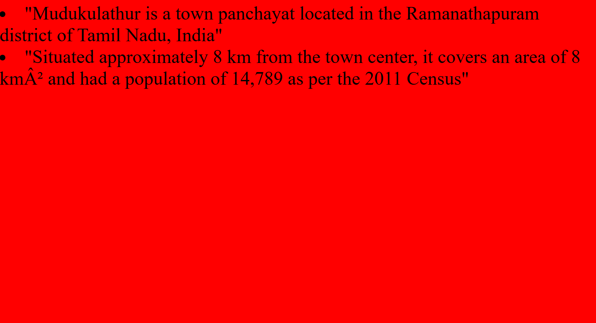

# Ex04 Places Around Me
## Date: 17/4/2025

## AIM
To develop a website to display details about the places around my house.

## DESIGN STEPS

### STEP 1
Create a Django admin interface.

### STEP 2
Download your city map from Google.

### STEP 3
Using ```<map>``` tag name the map.

### STEP 4
Create clickable regions in the image using ```<area>``` tag.

### STEP 5
Write HTML programs for all the regions identified.

### STEP 6
Execute the programs and publish them.

## CODE
```
map.html

<html>
 <head>
 <title>MyCity</title>
 </head>
 <body>
<h1 align="center">
 <font color="red"><b>Thanjavur</b></font>
 </h1>
 <h3 align="center">
 <font color="blue">Selvaganesg B (212224230258)</font>
 </h3>
 <center>
  

 <map name="MyCity">
    <area shape="rect" title="My Home Town" href="home.html" coords="700,250,850,400" shape="rect">
    <area shape="rect" title="Mudukulam" href="Mudukulam.html" coords="570,230,450,600" shape="rect">
    <area shape="rect" title="orathanadu" href="orathanadu.html" coords="570,230,900,400" shape="rect">
    <area shape="rect" title="vallam" href="vallam.html" coords="700,250,500,600" shape="rect">
    <area shape="rect" title="ullur" href="ullur.html" coords="700,250,450,600" shape="rect">
</map>
</center>
</body>
</html>

home.html

<html>
    <body bgcolor="yellow">
        <font size="100">
            <li>"Situated in the state of Tamil Nadu, India"</li>
            <li>"Lies in the fertile Cauvery Delta region, known as the "Rice Bowl of Tamil Nadu"</li>
        </font>
    </body>
</html> 

mudukulam.html

<html>
    <body bgcolor="red">
        <font size="100">
            <li>"Mudukulathur is a town panchayat located in the Ramanathapuram district of Tamil Nadu, India"</li>
            <li>"Situated approximately 8 km from the town center, it covers an area of 8 km² and had a population of 14,789 as per the 2011 Census"</li>
        </font>
    </body>
</html>

ullur.html

<html>
    <body bgcolor="green">
        <font size="100">
            <li>"Ulloor is named after Ulloor S. Parameswara Iyer, a distinguished poet and a member of the modern Malayalam literary triumvirate"</li>
            <li>"The Mahakavi Ulloor Memorial Library and Research Centre, established in 1956, honors his legacy and serves as a hub for Malayalam literature and non-formal education"</li>
        </font>
    </body>
</html>

vallam.html

<html>
    <body bgcolor="blue">
        <font size="100">
            <li>"Agowri Amman Temple: Features a unique two-headed statue of Mother Ambika, symbolizing both ferocity and grace"</li>
            <li>"Malai Mel Ayyanar Temple: Believed to date back to the time of Karikala Chola (circa 100 BC–190 AD)"</li>
        </font>
    </body>
</html>

orathanadu.html

<html>
    <body bgcolor="red">
        <font size="100">
            <li>"Orathanadu is a town in the Thanjavur district of Tamil Nadu, India, situated approximately 25 km from Thanjavur and 45 km from Kumbakonam"</li>
            <li>" It serves as the administrative headquarters of the Orathanadu taluk and is located on the south bank of the Kaveri River"</li>
        </font>
    </body>
</html>
```

## OUTPUT





## RESULT
The program for implementing image maps using HTML is executed successfully.
